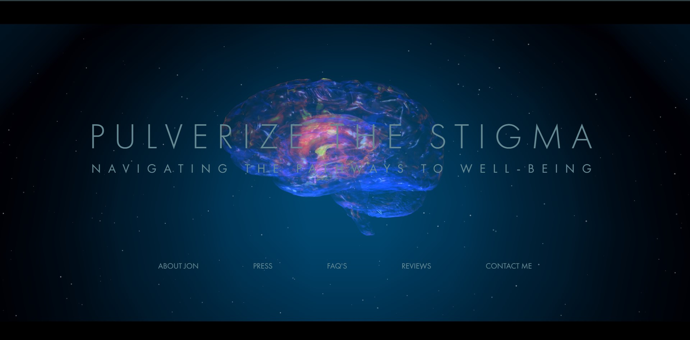

# HTML with THREEJS Project
<h4>by Syed Anas Tanweer</h4>

    

<!-- # Live Link
Click here: <a href="https://house-skull.vercel.app/" target="_blank">https://house-skull.vercel.app/</a> -->

# Introduction
This project include threejs model for client "jonathan" 

Resources: [Threejs](https://threejs.org/), [WebGL](https://github.com/KhronosGroup/WebGL), [webpack](https://webpack.js.org/) , [Babel](https://babeljs.io/ ), [ESLint](https://eslint.org/)

# Notes
Would be really appreciated if you are willing to give me a star here on GitHub 🎉